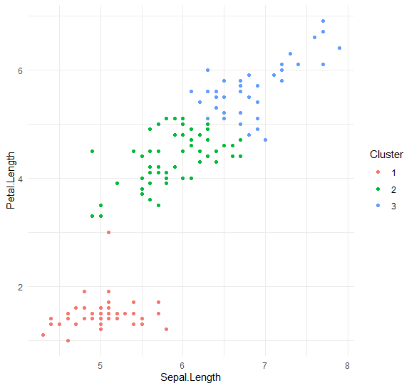

```{r, include = FALSE}
knitr::opts_chunk$set(
  collapse = TRUE,
  comment = "#>"
)
```

```{r setup}
library(kmeansj)
```

---

This package was create as a final project for the course "Multivariate Verfahren" at Ludwig-Maximilian Universität München held by Hannah Schulz-Kümpel in 2024. It is an exercise in implementing the well known k-means clustering algorithm that already exists in R **`base`** package.

## Installation

This package is currently not available on CRAN. You can install its current version from GitHub:
```
library(githubinstall)
library(devtools)

devtools::install_github("JoergSchantz/kmeansj")
```

## Overview

**`kmeansj`** provides:

- one base function `kmeansj()` which is the centre of this package
- individual functions for Lloyd's, MacQueen's and Hartigan-Wongs' iteration of the k-means clustering algorithm
- silhouette cluster validation
- simple prediction

```
library( tidyverse )
library( kmeansj )

data( "iris" )

iris %>% 
  mutate( Species, 
          Cluster = as.factor(
            kmeansj( iris %>% select( Sepal.Length, Petal.Length ) , k = 3 )$clusters 
            ) 
          ) %>%
  select( Sepal.Length, Petal.Length, Cluster ) %>%
  ggplot( aes( x = Sepal.Length, y = Petal.Length, color = Cluster) ) +
  geom_point() +
  theme_minimal()
```
**Output**



## Usage

`kmeansj( data, k, max_iter = 20, tol = 1e-4, method = "hw" )`

`kmeans_lloyd( data, k, max_iter = 20, tol = 1e-4 )`

`kmeans_mcq( data, k, max_iter = 20, tol = 1e-4 )`

`kmeans_hw( data, k, max_iter = 20, tol = 1e-4 )`

`silhouette( data, fit )`

`km_predict( data, fit )`

|**Arguments** | **Description** |
| :-------- | :------- |
| data |  your data - expects a data.frame, in case of `km_predict()` a new data.frame |
| k |  number of desired clusters - expects a in integer > 1  |
| max_iter |  maximum number of iterations the algorithm should go through if it does not converge - expects a integer |
| tol |  tolerance bound for convergance - expects a positive numeric |
| method |  specifies the desired clustering algorithm. One of the following: `lloyd`, `mcq` or `hw` |
| fit | expects a return object from `kmeansj()`, `kmeans_lloyd()`, `kmeans_mcq()` or `kmeans_hw()` |

## Details & Values

All clustering methods use the k-means++ initialization method for choosing starting centroids.

For `kmeansj()` and all other clustering functions a `list` which contains the following elements:

- `$clusters` respective centroid number for each observation
- `$centroids` coordinates of the last centroids
- `$totss` total sum of squares
- `$wss` within sum of squares for each cluster
- `$totwss` total within sum of squares
- `$btwss` between cluster sum of squares
- `$size` size of each cluster

For `silhouette()` a numeric, the `base::mean()` silhouette score.

For `km_predict()` ... XYZ ...

## Example
```
iris %>% 
  select( Sepal.Length, Petal.Length ) %>%
  kmeansj( k = 3 )
```
**Output**
```
$clusters
[1] 2 2 2 2 2 2 2 2 2 2 2 2 2 2 2 2 2 2 2 2 2 2 2 2 2 2 2 2 2 2 2 2 2 2 2 2 2 2 2 2 2 2 2 2 2 2 2 2 2 2
[51] 1 3 1 3 3 3 3 3 3 3 3 3 3 3 3 3 3 3 3 3 3 3 3 3 3 3 1 1 3 3 3 3 3 3 3 3 3 3 3 3 3 3 3 3 3 3 3 3 2 3
[101] 1 3 1 1 1 1 3 1 1 1 1 1 1 3 3 1 1 1 1 3 1 3 1 3 1 1 3 3 1 1 1 1 1 1 1 1 1 1 3 1 1 1 3 1 1 1 3 1 1 3
Levels: 1 2 3

$centroids
     Sepal.Length Petal.Length
[1,]     6.839024     5.678049
[2,]     5.007843     1.492157
[3,]     5.874138     4.393103

$totss
[1] 566.4937

$wss
        1         2         3 
20.407805  9.893725 23.508448 

$totwss
[1] 53.80998

$btwss
[1] 512.6838

$size
 1  2  3 
41 51 58 
```
